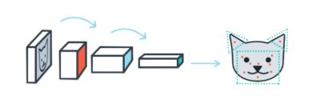

# Facial_Keypoint_Detector

This project combines computer vision techniques and deep learning architectures to build an end-to-end facial keypoint detection system that takes in any image with faces, and predicts the location of 68 distinguishing keypoints on each face!

Facial keypoints include points around the eyes, nose, and mouth on a face and are used in many applications. These applications include: facial tracking, facial pose recognition, facial filters, and emotion recognition. 

# Model Design
1. Detect all the faces in an image using a face detector (Haar Cascade detector is used in this project).
2. Pre-process face images so that they are grayscale, and transformed to a Tensor of the input size that your net expects. 
3. Use your trained model to detect facial keypoints on the image.

# Model Output

# To use
Clone the repository using command: git clone https://github.com/PreetiSajjan/Facial_Keypoint_Detector.git

The dataset used is included in the repository so need not to be downloaded explicitly.

# Contribution and References

Feel free to contribute to the project.

** Kindly cite if any part of the code is referred. **
